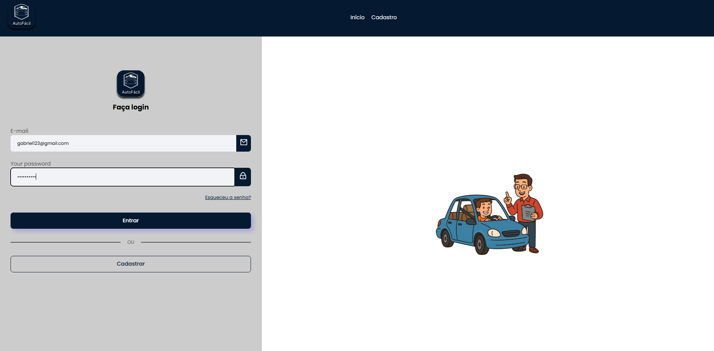
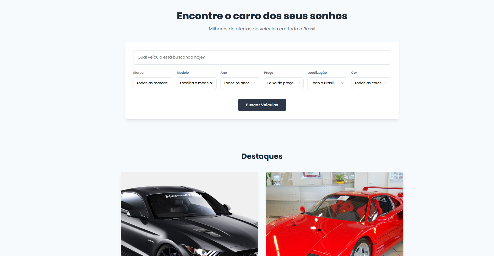
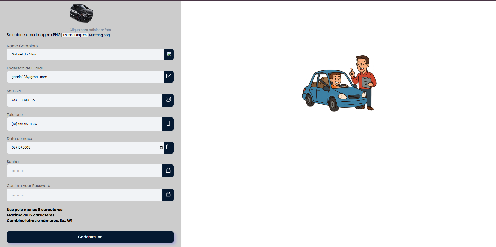
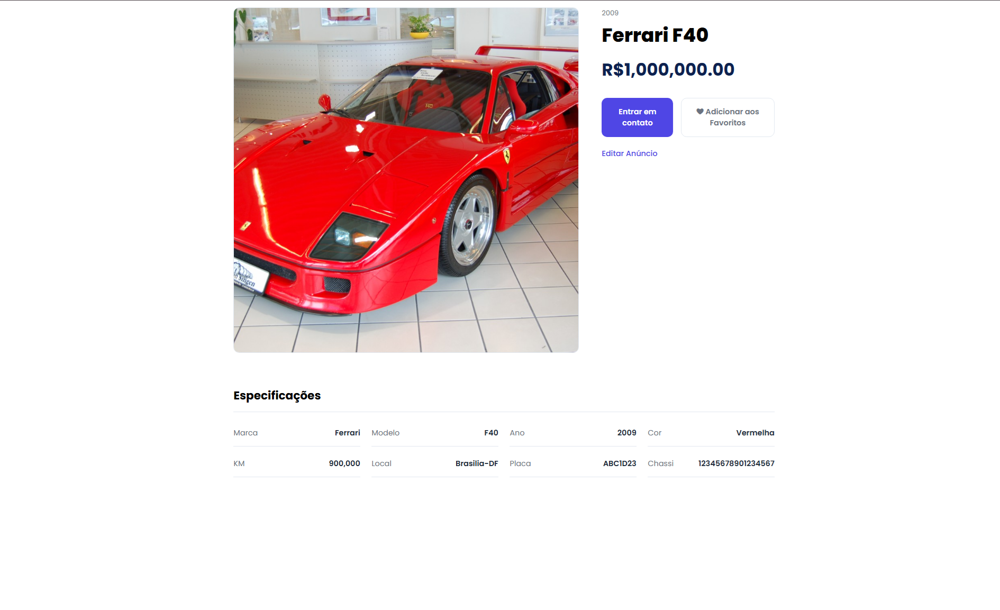

# AutoFácil - Plataforma de Gestão e Venda de Veículos


<p align="center">
  
  
  
  
  
</p>

<p align="center">
  Este projeto é um sistema web completo, Full-Stack, desenvolvido como Trabalho de Conclusão de Curso (TCC). A aplicação simula um marketplace para compra e venda de veículos, com um sistema robusto de gestão para os usuários.
</p>

---

## 🚀 Sobre o Projeto

O AutoFácil foi concebido para ser uma solução completa para o mercado automotivo, permitindo que usuários se cadastrem, anunciem seus veículos para venda, gerenciem seus anúncios e interajam com outros anúncios através de um sistema de favoritos. O projeto foi construído utilizando as tecnologias mais modernas do mercado, com foco em uma arquitetura limpa, segura e escalável.

---

## ✨ Funcionalidades Implementadas

O sistema conta com uma API RESTful robusta no backend e um frontend reativo e dinâmico.

### Backend (Spring Boot)
- **Segurança Completa com JWT:** Autenticação e autorização baseada em tokens para proteger os endpoints.
- **CRUD Completo de Veículos:** Endpoints para criar, ler, atualizar e deletar anúncios de veículos.
- **CRUD Completo de Usuários:** Endpoints para registro, busca de perfil, atualização e deleção de contas.
- **Upload de Múltiplos Arquivos:** Suporte a requisições `multipart/form-data` para upload de imagens de veículos e documentos PDF.
- **Sistema de Favoritos:** Lógica para que usuários possam favoritar e desfavoritar anúncios.
- **Busca Inteligente:** Endpoint de busca que permite filtrar veículos por marca ou por um termo de pesquisa (modelo/marca).
- **Ambientes com Docker:** Uso de `docker-compose` para criar um ambiente de desenvolvimento com PostgreSQL e pgAdmin.
- **Gerenciamento de Configuração:** Uso de perfis (`dev`, `test`) e variáveis de ambiente para proteger informações sensíveis.

### Frontend (Angular)
- **Arquitetura Reativa com Serviços:** Separação de responsabilidades entre serviços de API e serviços de estado (`AuthService`).
- **Gerenciamento de Estado de Autenticação:** Uso de `BehaviorSubject` para que a interface reaja em tempo real ao login e logout do usuário.
- **Navegação Dinâmica:** Header com menu de usuário que muda dinamicamente, mostrando opções como "Meu Perfil", "Meus Anúncios" e "Sair".
- **Rotas Protegidas:** Uso de `AuthGuard` para proteger rotas que só usuários logados podem acessar.
- **Interceptador de Requisições:** `HttpInterceptor` que anexa automaticamente o token JWT em todas as chamadas para a API protegida.
- **Formulários Reativos:** Formulários robustos para registro e cadastro de veículos com validações customizadas.

---

## 🛠️ Tecnologias Utilizadas

**Backend:**
* Java 17
* Spring Boot 3.3
* Spring Security (com JWT)
* Spring Data JPA / Hibernate
* PostgreSQL
* Docker e Docker Compose
* Lombok
* Maven

**Frontend:**
* Angular 18
* TypeScript
* RxJS (para programação reativa)
* SCSS
* ngx-toastr (para notificações)

**Ferramentas:**
* Postman (para testes de API)
* Git & GitHub (para versionamento)
* JUnit 5 & Mockito (para testes de unidade)

---

## ⚙️ Como Executar o Projeto

Para rodar este projeto localmente, você precisará ter o **Docker** e o **Node.js/NPM** instalados.

### 1. Backend (Spring Boot)

O backend é executado em um ambiente containerizado com Docker.

1.  **Clone o repositório:**
    ```bash
    git clone [https://github.com/Kalelzinw/Back-Gestao-Carros.git](https://github.com/Kalelzinw/Back-Gestao-Carros.git)
    cd Back-Gestao-Carros
    ```
2.  **Crie o arquivo de ambiente:**
    Na pasta raiz do projeto, crie um arquivo chamado `.env` e adicione as seguintes variáveis (substitua pelos seus segredos):
    ```
    DB_PASSWORD=sua_senha_segura_para_o_banco
    JWT_SECRET=sua_chave_secreta_longa_e_aleatoria_para_jwt
    ```
3.  **Inicie os contêineres:**
    No terminal, dentro da pasta do projeto, rode o comando:
    ```bash
    docker-compose up -d
    ```
    Isso irá iniciar o banco de dados PostgreSQL e o pgAdmin.
4.  **Crie o banco de dados:**
    * Acesse o pgAdmin em `http://localhost:5050`.
    * Faça login com as credenciais do seu `docker-compose.yml` (que agora leem do `.env`).
    * Crie um novo banco de dados com o nome `gestao_carros`.
5.  **Rode a aplicação:**
    Abra o projeto backend na sua IDE preferida (Eclipse, IntelliJ) e rode a classe `Application.java`. A API estará disponível em `http://localhost:8080`.

### 2. Frontend (Angular)

1.  **Navegue até a pasta do frontend:**
    ```bash
    cd ../frontend 
    ```
2.  **Instale as dependências:**
    ```bash
    npm install
    ```
3.  **Execute a aplicação:**
    ```bash
    ng serve
    ```
    Acesse a aplicação em `http://localhost:4200` (ou a porta que for indicada no terminal).

---

## 📸 Telas da Aplicação


| Tela de Login | Página Inicial (Home) |
| :---: | :---: |
|  |  |

| Formulário de Cadastro | Página de Detalhes do Veículo |
| :---: | :---: |
|  |  |

---

## 👨‍💻 Autor

**Wendell da Silva Valentim**

* [LinkedIn](https://www.linkedin.com/in/wendell-da-silva-valentim-34b558242/)
* [GitHub](https://github.com/Kalelzinw)

---

Este projeto foi desenvolvido com grande dedicação e foco em aprender e aplicar as melhores práticas do mercado de desenvolvimento web Full-Stack.
